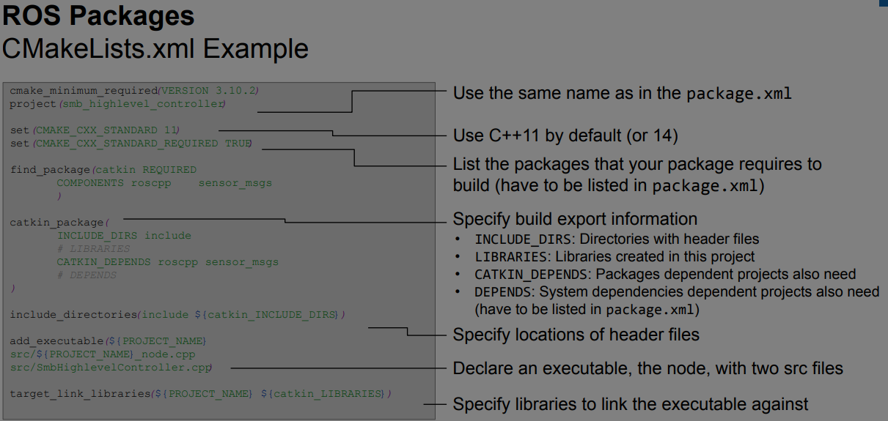
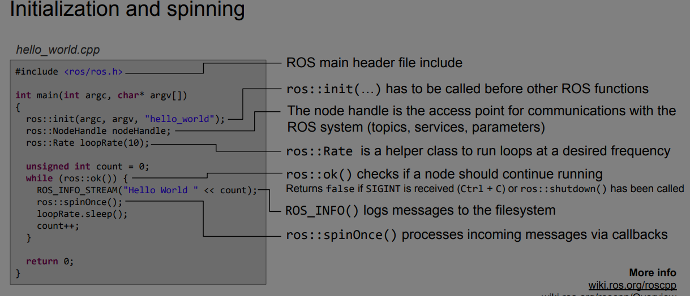

# Ros Documentation 

## Creating a catkin workspace 

If you just installed ROS noetic from apt on Ubuntu then you will have setup.*sh files in '/opt/ros/noetic/', and you could source them like
```bash
source /opt/ros/noetic/setup.bash
```
You will need to run this command on every new shell you open to have access to the ROS commands

```bash
 mkdir -p ~/catkin_ws/src   
 cd ~/catkin_ws/     
 catkin_make   
```

This creates additional build and devel folder in your current directory
This also creates a Cmakelist.txt file in your src folder when you run this command for the first time

```bash
source devel/setup.bash
```
Run this command to use the catkin commands

## Ros packages

The simplest possible package has a structure which looks like this:
* CMakeLists.txt
  
* package.xml

A trivial workspace might look like this

```
workspace_folder/        -- WORKSPACE
  src/                   -- SOURCE SPACE
    CMakeLists.txt       -- 'Toplevel' CMake file, provided by catkin
    package_1/
      CMakeLists.txt     -- CMakeLists.txt file for package_1
      package.xml        -- Package manifest for package_1
    ...
    package_n/
      CMakeLists.txt     -- CMakeLists.txt file for package_n
      package.xml        -- Package manifest for package_n
```
You can create a package by running the following command

```bash
$ catkin_create_pkg <package_name> [depend1] [depend2] [depend3]
```
creating a new package called 'beginner_tutorials' which depends on std_msgs, roscpp, and rospy:
```bash
catkin_create_pkg beginner_tutorials std_msgs rospy roscpp
```

Building the package
```bash
cd ~/catkin_ws
catkin_make
```
## Ros Nodes
A node is an executable that uses ROS to communicate with other nodes.    

ROS nodes use a ROS client library to communicate with other nodes. Nodes can publish or subscribe to a Topic. Nodes can also provide or use a Service.

### Roscore
Roscore is the first thing that you should run while using ros   
```bash
roscore
```

### Rosnode
Rosnode displays information about the ROS nodes that are currently running. The rosnode list command lists these active nodes:
``` bash
rosnode list
```
### Rosrun
rosrun allows you to use the package name to directly run a node within a package
```bash
rosrun [package_name] [node_name]
```

For example:
```bash
rosrun turtlesim turtlesim_node
```

You can retrieve information about a node by using
```bash
rosnode info node_name
```

## Ros topics
Nodes communicate over topics   
Nodes can publish or subscribe to a topic   
Topic is a name for a stream of messages   

* You can get the list of active topics by
  ```bash
  rostopic list
  ```
* You can get info about a specific topic by
  ```bash
  rostopic info /topic
  ```
* rostopic echo shows the data published on a topic.
  ```bash
  rostopic echo /topic
  ```

## Ros messages
Data structure defining the type of a topic    
command to see the type of a topic
```bash
rostopic type /topic
```
command to publish a message to a topic 
```bash
# rostopic pub [topic] [msg_type] [args]
rostopic pub -1 /turtle1/cmd_vel geometry_msgs/Twist -- '[2.0, 0.0, 0.0]' '[0.0, 0.0, 1.8]'
```

## Ros launch
* Launch multiple nodes
* Launches launch files which are written in XML as *.launch

```bash
#Browse to the folder and start a launch file with
 roslaunch file_name.launch
```
####             Or
```bash
#Start a launch file from a package with
roslaunch package_name file_name.launch
```

## Cmake list 


## Ros C++ client library (Ros cpp)


* Logging   
  Instead of std::cout, use e.g. ROS_INFO
```bash
ROS_INFO("Result: %d", result); // printf
ROS_INFO_STREAM("Result: " << result);
```
* Ros Subscriber
  * When a message is received, callback function is called with the contents of the message as argument
  * Start listening to a topic by calling the method subscribe() of the node handle
```bash
ros::Subscriber subscriber = nodeHandle.subscribe(topic, queue_size, callback_function);
```

* Publisher
  Create a publisher with
```bash
ros::Publisher publisher = nodeHandle.advertise<message_type>(topic, queue_size);
```
   create message contents and publish with
```bash
  publisher.publish(message);
```

## Rviz
* 3D visualisation tool for ROS
* Subscribes to topics and visualizes the message contents
* Interactive tools to publish user information
* Save and load setup as RViz configuration
* Extensible with plugins
* Run RViz with
```bash
rviz
```


